## Strategy Optimization – Phase 1: Baseline Performance

The optimization process began with a baseline evaluation of the simple moving average (SMA) crossover strategy, using a `FAST=10` and `SLOW=30` configuration. This configuration was chosen as a classic starting point commonly referenced in literature and industry practice, offering a straightforward way to assess trend-following behavior before applying advanced filters or tuning.

### Entry Logic

The core logic is based on the crossover of two simple moving averages:

- **Long Entry**: Triggered when the fast SMA (10) crosses above the slow SMA (30).
- **Short Entry**: Triggered when the fast SMA (10) crosses below the slow SMA (30).

No additional filters or exit rules were used at this stage. Each crossover directly reversed the existing position, and the system was always in the market — either long or short.

### Equity Curve Analysis

The equity curve for this configuration is shown below:

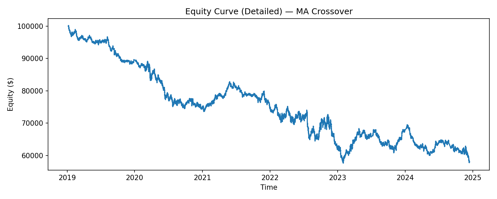

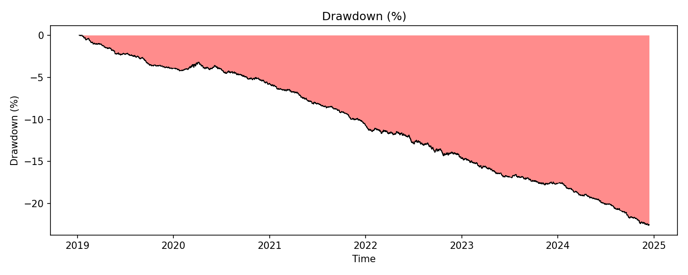

Despite being a common starting point, the strategy shows a **clear long-term downtrend in equity** from 2019 through the end of 2024. While some periods (e.g. mid-2021 or early 2023) briefly recover, the system consistently fails to maintain any sustainable profitability.

### Strategy Metrics (No Fees)

Below is the breakdown of the trade statistics for this configuration:

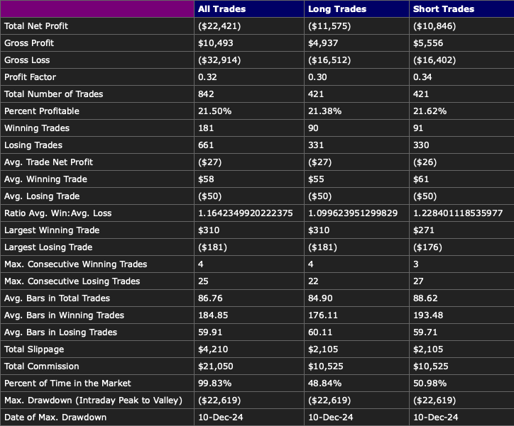

#### Notable Metrics:

- **Net Profit**: -$22,421
- **Total Trades**: 842
- **Win Rate**: 21.5%
- **Profit Factor**: 0.32
- **Average Trade**: -$27
- **Max Drawdown**: -$22,619
- **% of Time in Market**: 99.83%
- **Date of Max Drawdown**: Dec 10, 2024

The average trade net profit is deeply negative, and the low profit factor (0.32) implies that losses far outweigh gains. Despite a decent average win size (~$58), the low win rate results in a highly unstable equity profile.

### Interpretation

This test served to **validate system logic and expose weaknesses** before optimization. While structurally sound, the crossover signal alone without exits or filters results in:

- Overtrading during consolidation
- Whipsaw losses in non-trending periods
- Poor reward-to-risk dynamics

## Strategy Optimization – Phase 2: Baseline Performance with Trading Costs

Following the initial evaluation of the moving average crossover strategy using `FAST=10` and `SLOW=30`, we introduced **realistic trading costs** to simulate market friction and slippage. These include:

- **Commission**: $25
- **Slippage**: $5
- **Total Round Turn Cost**: **$30**

### Updated Equity Curve and Drawdown

Below is the updated equity curve after accounting for trading costs:

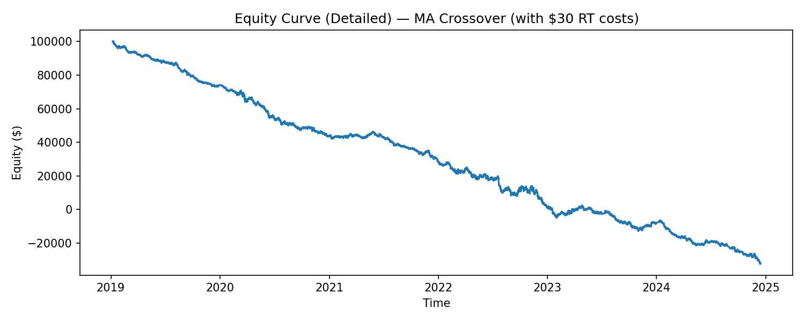

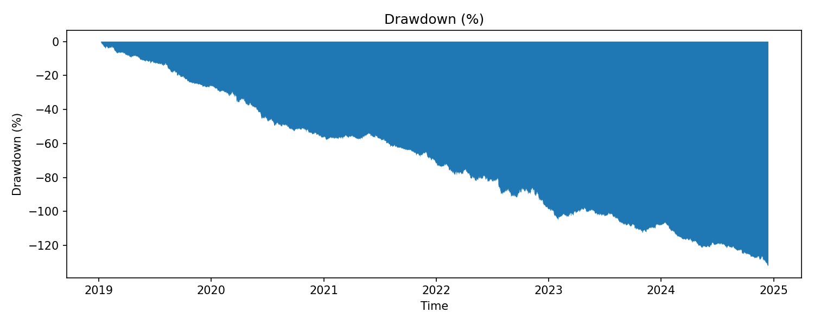

The updated curve demonstrates a **complete deterioration of system profitability**, now closing the simulation with a negative equity balance and drawdowns exceeding 100%.

### Strategy Metrics (With Costs)

Despite having a larger sample of 3,006 trades, the strategy suffers from unsustainable drawdowns and negative expectancy:

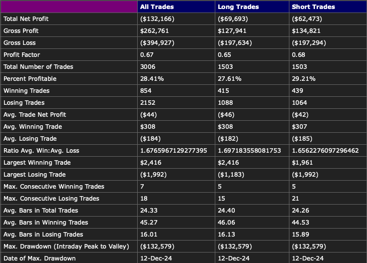

#### Notable Metrics:

- **Total Net Profit**: -$132,166
- **Profit Factor**: 0.67
- **Win Rate**: 28.41%
- **Average Trade**: -$44
- **Max Drawdown**: -$132,579
- **Max Losing Trade**: -$1,992
- **Percent Time in Market**: ~100%
- **Date of Max Drawdown**: Dec 12, 2024

The **profit factor below 1.0** and negative average trade value indicate that the system’s edge is completely eroded once execution costs are considered.

### Interpretation

Factoring in fees highlights the fragility of simple crossover strategies in high-frequency environments. While the strategy recorded over 3,000 trades, the signal failed to maintain profitability due to:

- Excessive churning from frequent entries
- High cumulative transaction costs ($21,050 commission + $4,210 slippage)
- Poor risk-adjusted return metrics

## Strategy Optimization – Phase 3: Parameter Grid Search and Optimal Configuration

Having established that the base strategy underperforms with its initial parameters, we conducted a **grid search optimization** to explore the sensitivity and robustness of the moving average crossover logic. The objective was to identify a region of parameter space where performance improves despite trading costs.

### Grid Search Surface – Ending Equity

The 3D surface below shows the ending equity over a sweep of Fast and Slow moving average values:

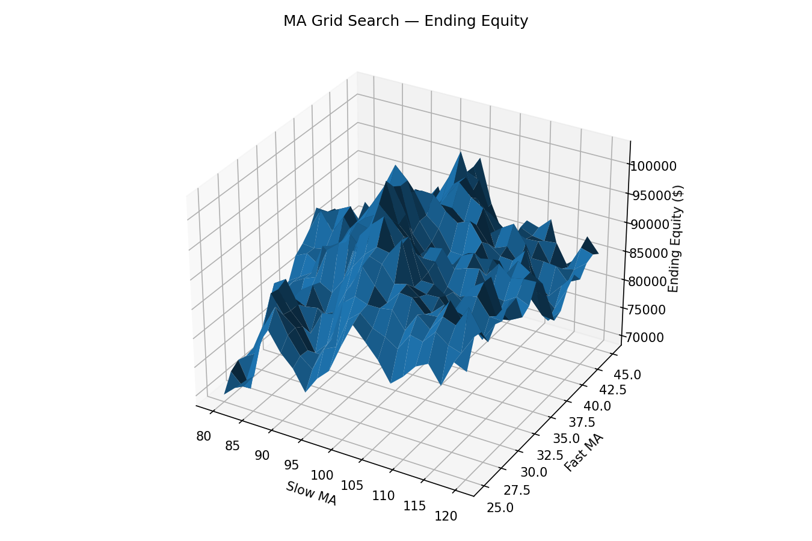

- **X-axis**: Slow MA values (range: 80–120)
- **Y-axis**: Fast MA values (range: 25–45)
- **Z-axis**: Final equity ($)

The surface indicates a **ridge of consistently better performance** when the slow moving average is in the 95–105 range and the fast moving average is around 30–35. This suggests some degree of robustness in this region.

We selected one of the top-performing combinations from this ridge:  
**Fast = 33**, **Slow = 98**

---

### Optimized Strategy Performance (Fast = 33, Slow = 98)

#### Equity Curve

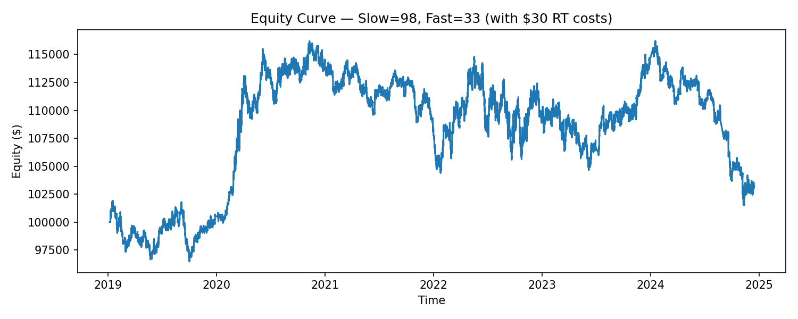

#### Drawdown Chart

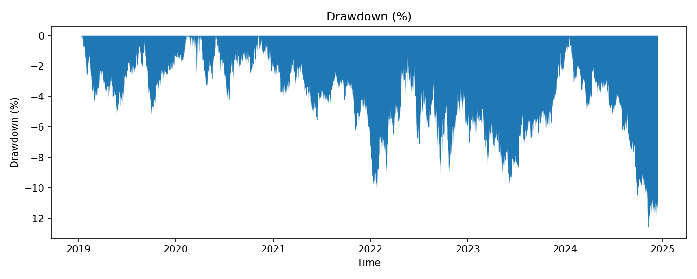

This configuration displays **more stable equity growth**, particularly from mid-2019 through 2021, and significantly reduced volatility compared to the baseline.

---

### Optimized Trade Metrics

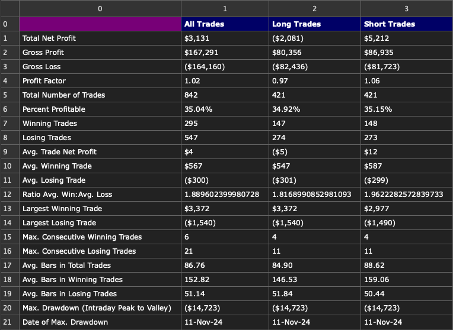

#### Notable Metrics:

- **Net Profit**: +$3,131
- **Profit Factor**: 1.02
- **Win Rate**: 35.04%
- **Avg Trade**: +$4
- **Max Drawdown**: -$14,723
- **Largest Win**: +$3,372
- **Largest Loss**: -$1,540
- **Time in Market**: 99.83%
- **Date of Max Drawdown**: Nov 11, 2024

This version of the strategy, despite being relatively simple, manages to **break even or slightly profit** after costs — a substantial improvement over the original configuration.

### Interpretation

The grid search confirms:

- A **stable region** exists in the parameter space with improved return and drawdown profiles.
- The optimal settings (`Fast=33`, `Slow=98`) offer slightly positive expectancy, with a **profit factor > 1**.
- Drawdown is considerably more manageable, and the average winning trade is nearly **double** the average loss.

## Strategy Optimization – Phase 4: Session Window Filtering

After optimizing the moving average parameters, the next step was to refine **when** trades are allowed during the trading day. Many strategies perform better during specific market sessions (e.g., London open, NY open), and filtering trades by time can drastically improve risk-adjusted returns.

We implemented a **session sweep**, iterating through the day in 30-minute increments and taking trades **only during a 4-hour window starting at each point** (inclusive). For each window, we computed the net profit across the full backtest period.

### Net Profit vs Start Time

This plot reveals **two distinct periods of profitability**:

- **01:00–05:00**
- **13:00–17:00**

The latter session aligns with the **New York open and early overlap with London**, which tends to bring high volatility and clearer directional moves.

We selected the **13:00–17:00** window for final testing based on profitability, tradability, and alignment with real-world liquidity.

---

### Final Equity Curve (FAST=33, SLOW=98, Session: 13:00–17:00)

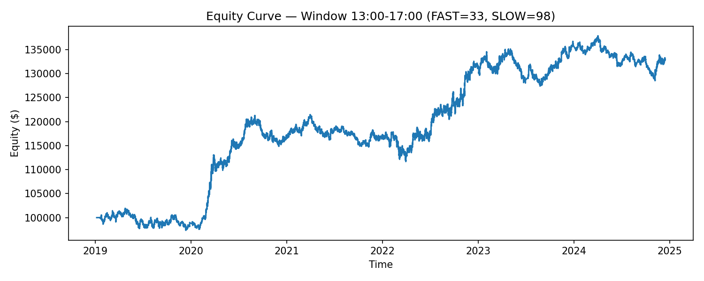

The strategy now shows a **consistent and stable equity curve**, outperforming earlier iterations by a significant margin. Drawdowns are reduced and equity rises steadily from 2020 onward.

---

### Drawdown Chart

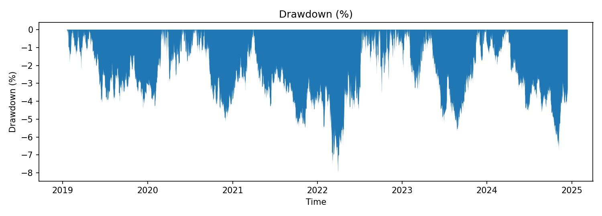

Drawdown remains **under 8%** for the duration of the backtest — a substantial improvement over the baseline system.

---

### Filtered Trade Statistics

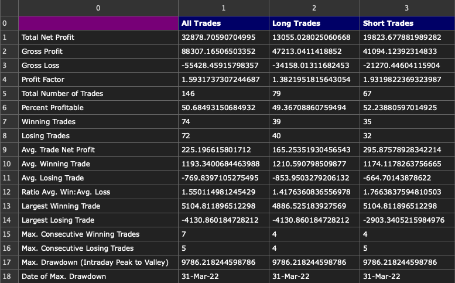

#### Notable Metrics:

- **Net Profit**: +$32,878
- **Profit Factor**: 1.59
- **Avg Trade**: +$225
- **Win Rate**: 50.68%
- **Max Drawdown**: -$9,786
- **Largest Win**: +$5,104
- **Largest Loss**: -$4,130
- **Time in Market**: Highly Reduced
- **Date of Max Drawdown**: Mar 31, 2022

This version of the strategy shows a **complete transformation**:

- From loss-making to consistently profitable
- From >100% drawdowns to <10%
- From low expectancy to a high **reward-to-risk ratio** (~1.55)

---

### Interpretation

This session-based filtering demonstrates the **importance of time in intraday strategies**. By isolating trades to high-probability windows:

- **Noise is reduced**, and signal strength improves
- **Drawdowns are minimized**
- **Trade quality and profitability increase**

## Strategy Review – Trade Behavior & Monthly Performance Insights

With the core components of the strategy now optimized (parameters, session timing), we took a final look at the **behavior of individual trades** and **performance trends across months** to better understand edge durability and potential areas for further refinement.

### Profit vs Drawdown (Per Trade)

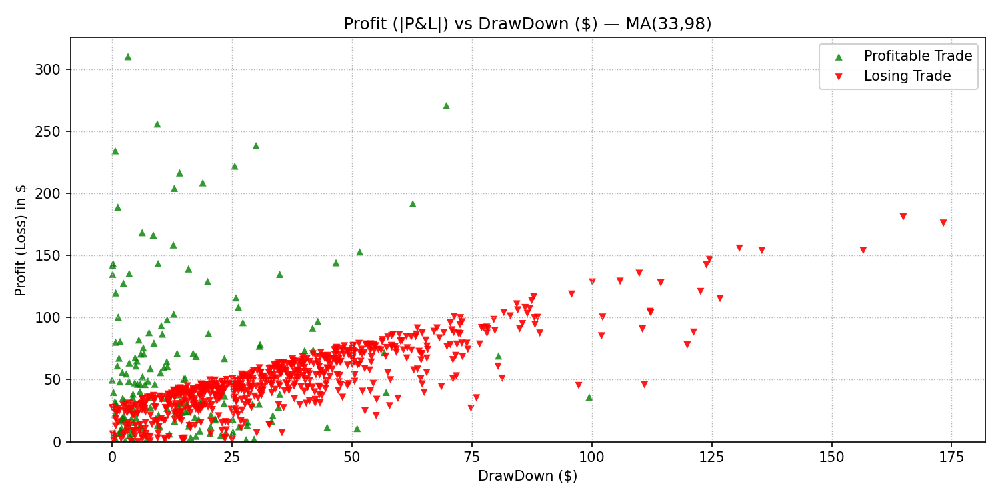

This scatterplot shows the relationship between **maximum drawdown per trade** and the corresponding trade’s **absolute profit or loss**:

- **Profitable trades (green triangles)** tend to cluster at low drawdowns, though some large profits are possible even after small drawdowns.
- **Losing trades (red triangles)** display a more linear relationship — higher drawdowns generally lead to worse losses.

This visualization highlights the **potential benefit of a protective stop**, which could cut off losses when drawdown thresholds are breached.

---

### Maximum Adverse Excursion (MAE)

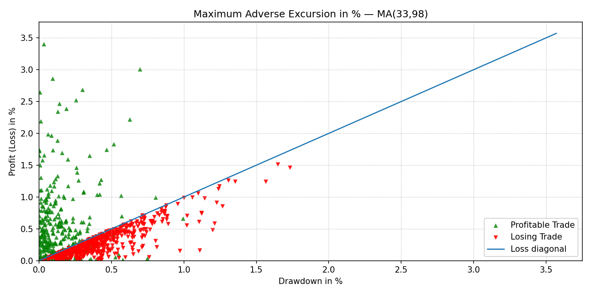

The MAE plot above shows trade-level performance in **percentage terms**, overlaid with the **loss diagonal**:

- Most profitable trades occur **below the diagonal**, meaning drawdowns were small compared to final profits.
- Losing trades **cluster tightly along the diagonal**, suggesting that once drawdown exceeds ~0.6%, the trade rarely recovers.

This supports the idea of inserting a **risk stop loss around 0.6%**, to filter out trades that statistically don’t recover.

---

### Average Monthly Profitability

Here we evaluate average monthly profit across the full backtest period:

- The system shows **clearly cyclical performance**.
- Some months (Janarury, June, December) display recurring losses, while others (February, March, May, July) are consistently profitable.

This analysis suggests that **monthly filters or volatility regimes** could further enhance the system — e.g., disabling trading in historically poor-performing months or adjusting position sizing based on seasonal volatility.

---

### Final Thoughts

Despite this system showing **significant improvements** over its initial form, it still presents **opportunities for enhancement**. Some directions worth pursuing include:

- **Dynamic stop loss & trailing stop** design (based on MAE distribution)
- **Monthly or seasonal filters** to avoid recurring loss periods
- **Position sizing optimization** based on rolling volatility
- **Trade clustering analysis** to detect overtrading or signal noise

As with any trading system, **performance is not static**. This review phase illustrates the importance of iterative analysis — ensuring a strategy not only performs in backtests but continues to adapt and refine based on deeper behavioral insights.

> In trading system development: testing is just the beginning — **understanding trade behavior is how you evolve it.**
