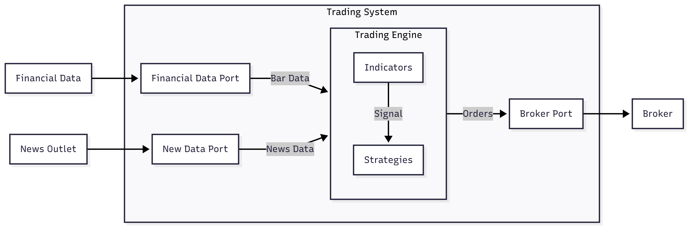
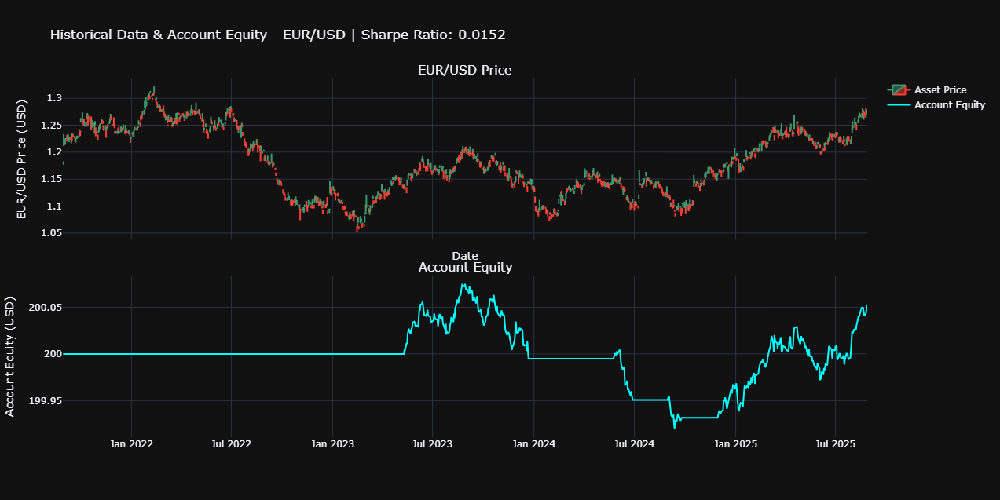
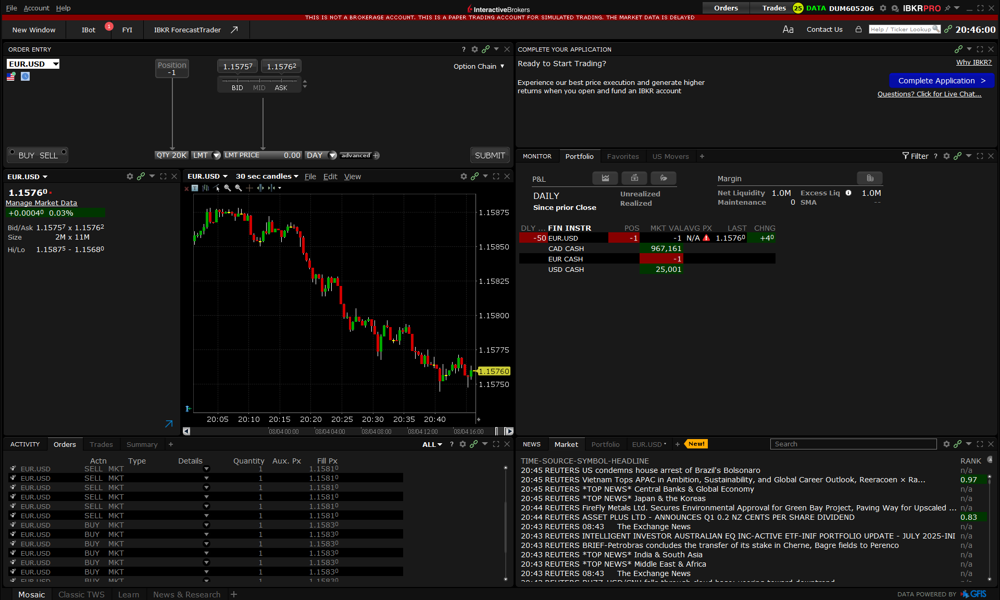

# Onyx Trading Engine

A modular and extensible trading strategy creation platform built with scalable design patterns, supporting live trading (Interactive Brokers) and backtesting (custom/Yahoo adapters) for stocks, forex, and more.

## Features
- **Live Trading:** Connects to Interactive Brokers (IB or IBkr) via IB API and Traders Works Station (TWS) for real-time execution.
- **Backtesting:** Simulate strategies using historical data from Yahoo Finance or custom CSVs.
- **Strategy Framework:** Easily implement and swap trading strategies (e.g., Moving Average Crossover).
- **Thread-Safe Data Flow:** Robust handling of live and historical bar data using queues and event-driven callbacks.
- **Comprehensive Logging:** Unified logging for all trades, statistics, and system events.
- **Visualization:** Candlestick charts with buy/sell markers for backtest results.

## Quick Start

To setup the environment, read and follow [`src/README.md`](src/README.md)


## Architecture Overview



- **Domain Models:** `Asset`, `Bar` (stocks, forex, crypto, etc.)
- **Ports:** `MarketDataPort`, `BrokerTradePort` (abstract interfaces)
- **Adapters:** IB API, Yahoo Finance, Custom Backtest
- **Strategies:** Modular, plug-and-play (e.g., Moving Average, Kalman Filter)
- **Engine:** Orchestrates data, strategy, and broker actions

## Example: Moving Average Crossover Strategy

### Code Implementation

Strategies in **Onyx Trading Engine** are built on our proprietary framework that enforces a clean separation between domain models, ports, and adapters.  
This allows the same strategy code to be backtested on historical data and then deployed directly to Interactive Brokers for live trading.

```python
from src.core.logic.trading_engine import TradingEngine
from src.core.adapters.yf_market_adapter import YFMarketDataAdapter
from src.core.logic.moving_average import MovingAverageCrossoverStrategy
from src.core.adapters.custom_broker_adapter import CustomBrokerAdapter
from src.core.models.asset import Asset, AssetType
from datetime import datetime, timedelta

if __name__ == "__main__":
    # Define the trading instrument
    asset = Asset(AssetType.FOREX, "EUR", "USD")

    # Market data adapter (historical data for backtesting)
    market_data_adapter = YFMarketDataAdapter(asset)
    market_data_adapter.request_historical_data(
        asset, datetime.today()-timedelta(days=365*4), datetime.today()
    )

    # Broker adapter (simulated broker for backtesting)
    broker_adapter = CustomBrokerAdapter(10000)

    # Strategy (uses abstract ports, works in backtest or live trading)
    strategy = MovingAverageCrossoverStrategy(broker_adapter, asset)

    # Trading engine orchestrates data, strategy, and broker actions
    trading_engine = TradingEngine(broker_adapter, market_data_adapter, [strategy])
    trading_engine.run(asset, threaded=False)
```
### Backtesting Results

During backtesting, results are visualized as candlestick charts with buy/sell markers.  
For example, the Moving Average Crossover strategy produces the following backtest chart:



### Seamless Transition to Live Trading

Because strategies depend only on **abstract ports** (`MarketDataPort` and `BrokerTradePort`), the same code can be run in a live trading environment by simply swapping adapters:  

- Replace `YFMarketDataAdapter` with `IbApiDataAdapter`  
- Replace `CustomBrokerAdapter` with `IbBrokerAdapter`  

No changes to the strategy logic or engine are required—ensuring smooth deployment from **backtesting to production trading**.




## Authors
- [Josue Dazogbo](https://github.com/JDazogbo)
- [Sultan Oloyede](https://github.com/sultanoloyede)
- [Jedidiah Ange-Emmanuel Kouakou](https://github.com/ARelaxedScholar)
- [Racine Kane](https://github.com/Racine-04)

## Resources
- [Installation Guide](src/README.md)
- [Quantitative Analysis Reports](Resources/Reports)